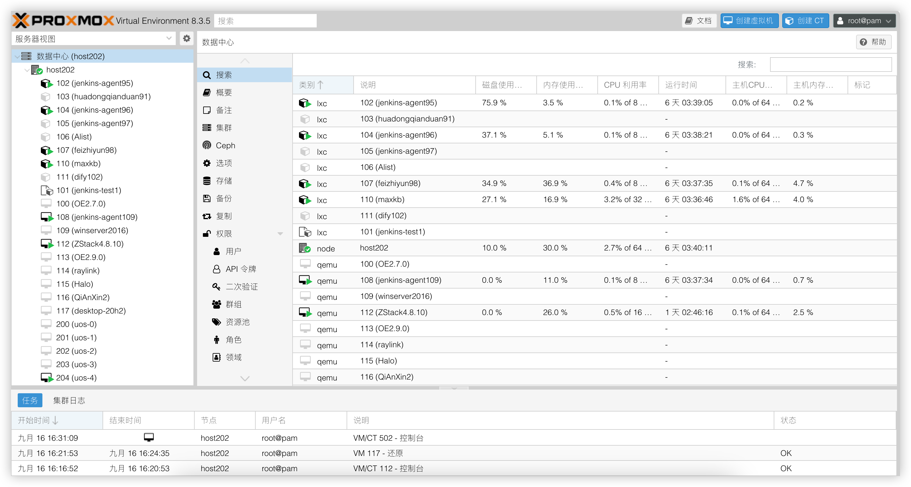

# 合作伙伴

#### Proxmox官方授权合作伙伴

上海瞰融信息技术发展有限公司自 2018 年成立以来，始终专注于 IT 基础设施领域。作为Proxmox官方授权合作伙伴，我们为中国地区客户提供 Proxmox Virtual Environment相关产品的正版订阅、技术支持、部署实施、培训与售后等全流程服务。

通过与 Proxmox 官方紧密合作，我们将企业级的开源虚拟化技术与本地化支持服务结合，助力中国企业构建高性能、高可靠的 IT 基础架构。

    <picture>
        <source srcset="/proxmox-logo.png" media="(prefers-color-scheme: dark)">
        
    </picture>

    <ul>
        <li>Proxmox官方授权合作伙伴
        </li>
          <li>Proxmox VE虚拟化平台代理
        </li>
          <li>中国本地化技术支持服务
        </li>
    </ul>

#### PVE产品介绍

Proxmox Virtual Environment是一个开源的企业级服务器虚拟化管理平台。将 KVM 虚拟机管理程序和 Linux 容器 （LXC）、软件定义存储和网络功能紧密集成在一个平台上。借助基于 Web 的集成用户界面，您可以轻松管理虚拟机和容器、集群的高可用性或集成的灾难恢复工具。

[了解更多（点击链接可跳转至Proxmox VE官方地址）](https://www.proxmox.com/en/products/proxmox-virtual-environment/overview)

#### 选择 PVE，开启高效虚拟化之路

哪些企业适合使用 Proxmox VE？
- 外资制造企业：汽车、电子、化工等行业，建设虚拟化平台
- 教育科研机构：搭建教学实验环境、虚拟计算集群
- 金融与保险行业：构建私有云平台，满足安全与业务连续性需求
- 医药、零售、快消、咨询等企业

我们的客户画像
- 有 本地化/内网部署 需求，无法上公有云
- 对 成本敏感，寻求 VMware 替代方案
- 需要 定制化集成能力，支持对接现有平台
- 满足 数据安全、合规 等政策要求

典型业务场景
- 搭建私有云平台，中英文混合支持
- 部署企业内部办公、研发、测试环境
- 提供高可用、高可靠的虚拟化基础设施
- 统一管理多租户虚拟机资源

#### 我们提供的服务

- Proxmox VE 虚拟化平台：企业级服务器虚拟化部署、集群建设、高可用方案实施
- 多云管理平台：与 Proxmox API 深度集成，实现多云统一管理
- 企业级存储解决方案：Ceph、ZFS、LVM 等分布式存储架构设计与运维
- 云桌面解决方案：基于 PVE 的桌面虚拟化（VDI）部署与运维
- 企业定制支持：Proxmox 订阅授权、版本升级、迁移服务、故障响应支持

#### 为什么选择瞰融

- 本地化支持团队：总部位于中国上海，辐射长三角及全国主要经济区域
- 专业技术实力：深耕虚拟化、云平台、存储等基础设施领域
- 官方合作背书：获得 Proxmox 官方合作伙伴认证
- 丰富企业交付经验：已为 40+ 家企业成功交付服务器及虚拟化平台解决方案

### 联系我们

如需了解更多或获取技术支持，请联系：
- 电话：021-xxxxxxx
- 邮箱：info@krcloud.com
- 地址：上海市浦东新区xxxx号

<footer>
页脚内容与首页一致，自动适配。
</footer>
